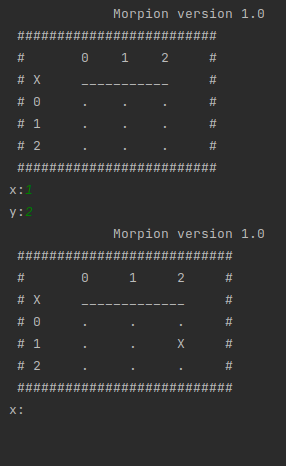
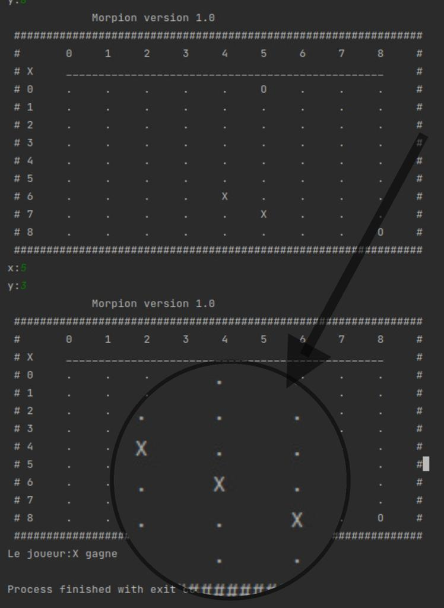

## Le morpion

Le morpion est un jeu de réflexion se pratiquant à deux joueurs au tour par tour et dont le but est de créer le premier un alignement sur une grille.

source [wikipedia](https://fr.wikipedia.org/wiki/Morpion_(jeu))

## Les versions attendues à la fin du projet

- La version 1^ se jouera sur la console, avec une grille carré de 3X3, 4X4 ... nxn
- La version 2^ se jouera dans une interface graphique avec des boutons sur une grille carrée de 3X3, 4X4 ... nxn
- La version 3^ se jouera sur une interface graphique, avec une grille dynamique et plusieurs joueurs

La saisie se fait sous la console, en saisissant la position du pion (x et y)

Le plateau est dynamique, il s'adapte à toutes dimensions

